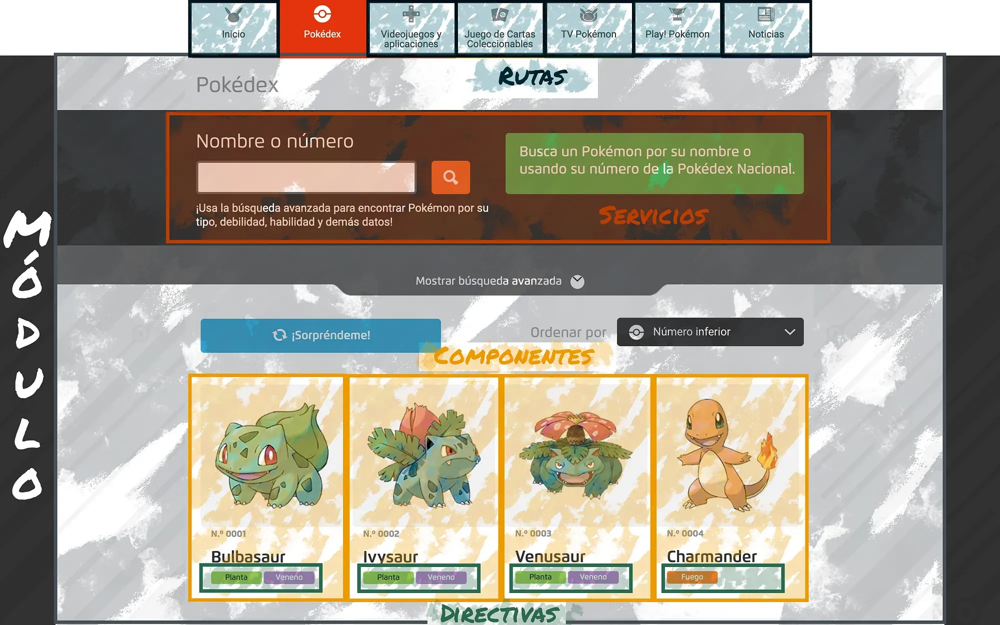
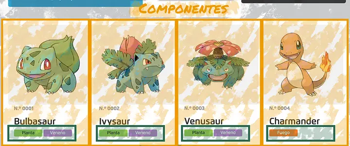
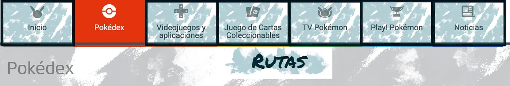
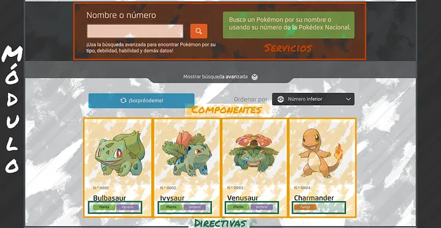
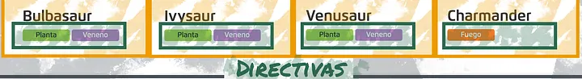

# AngularDex

[](https://angular.io/)
[](https://www.typescriptlang.org/)
[](https://rxjs.dev/)
[](https://pokeapi.co/)

AngularDex es una Pokédex desarrollada con Angular como [proyecto práctico de curso](https://medium.com/@bosarreyesrodrigo/presentaci%C3%B3n-del-proyecto-angulardex-5e08e0c02932). Su objetivo es consolidar conceptos esenciales del framework construyendo una aplicación real: rutas, módulos, componentes reutilizables, servicios con llamadas HTTP, pipes y directivas personalizadas.

La aplicación consume datos de [PokeAPI](https://pokeapi.co/) para mostrar un listado de Pokémon y una vista de detalle con información ampliada, tipos, habilidad, descripción, debilidades y navegación entre Pokémon.

## Qué se trabaja en este proyecto

- **Componentes**: cada pieza visual se encapsula en componentes reutilizables, como tarjetas, página de listado, detalle, información y paginación.
  
- **Enrutamiento**: la aplicación redirige a la Pokédex desde la ruta raíz y permite consultar el detalle de cada Pokémon mediante rutas dinámicas.
  
- **Módulos**: la funcionalidad de Pokémon vive en su propio módulo, cargado mediante lazy loading para mantener una estructura limpia y escalable.
  
- **Servicios**: `PokemonService` centraliza las llamadas a PokeAPI y transforma la respuesta para que los componentes trabajen con un modelo coherente.
  
- **Directivas**: `PokemonTypeDirective` aplica estilos visuales según el tipo del Pokémon.
  
- **Pipes**: se utilizan pipes para formatear identificadores y traducir tipos al español.

## Funcionalidades

- Listado inicial de Pokémon con imagen oficial, número, nombre y tipos.
- Navegación al detalle al seleccionar un Pokémon.
- Vista de detalle con descripción, categoría, altura, peso, habilidad y debilidades.
- Navegación anterior/siguiente entre Pokémon desde la página de detalle.
- Colores dinámicos por tipo de Pokémon mediante una directiva personalizada.
- Traducción de tipos de Pokémon al español mediante pipe.
- Página 404 para rutas no reconocidas.

## Stack técnico

- Angular 16
- TypeScript
- RxJS
- Angular Router
- Angular HttpClient
- SCSS
- Karma + Jasmine para tests unitarios
- PokeAPI como API externa

## Estructura del proyecto

```text
src/
  app/
    core/
      components/
        page-not-found/
    modules/
      pokemon/
        components/
          pokemon-card/
          pokemon-detail/
          pokemon-info/
          pokemon-page/
          pokemon-pagination/
        directives/
          pokemon-type/
        models/
        pipes/
          translate-type/
        services/
        pokemon-routing.module.ts
        pokemon.module.ts
    shared/
      pipes/
        pad-start/
    app-routing.module.ts
    app.module.ts
  assets/
  styles/
```

## Rutas principales

| Ruta           | Descripción                               |
| -------------- | ----------------------------------------- |
| `/`            | Redirige a `/pokemon`                     |
| `/pokemon`     | Muestra el listado principal de Pokémon   |
| `/pokemon/:id` | Muestra el detalle de un Pokémon concreto |
| `**`           | Muestra la página 404                     |

## Instalación

Clona el repositorio e instala las dependencias:

```bash
npm install
```

También puedes usar pnpm si prefieres trabajar con el lockfile incluido:

```bash
pnpm install
```

## Ejecución en desarrollo

Levanta el servidor local:

```bash
npm start
```

La aplicación estará disponible en:

```text
http://localhost:4200/
```

## Scripts disponibles

```bash
npm start
```

Inicia el servidor de desarrollo de Angular.

```bash
npm run build
```

Genera la versión de producción en `dist/`.

```bash
npm run watch
```

Compila en modo observación usando la configuración de desarrollo.

```bash
npm test
```

Ejecuta los tests unitarios con Karma y Jasmine.

## Arquitectura funcional

El proyecto parte de una idea sencilla: si cada Pokémon comparte una misma estructura visual, la interfaz puede construirse a partir de una tarjeta reutilizable alimentada por datos dinámicos. El listado obtiene información desde PokeAPI, la adapta al modelo `Pokemon` y renderiza una colección de componentes `PokemonCardComponent`.

Cuando el usuario selecciona un Pokémon, Angular Router navega a la ruta de detalle. En esa vista, el servicio combina distintas llamadas a la API para obtener datos específicos como especie, descripción en español, habilidad principal y debilidades calculadas según los tipos.

Esta separación permite que los componentes se centren en pintar la interfaz, mientras que el servicio concentra la lógica de obtención y transformación de datos.

## Objetivo didáctico

AngularDex está pensado para aprender Angular construyendo. Al finalizarlo, se habrán practicado los patrones más habituales de una aplicación Angular: organización por módulos, lazy loading, composición de componentes, consumo de APIs, uso de RxJS, rutas dinámicas, pipes, directivas y estilos encapsulados.

La meta no es solo crear una Pokédex, sino entender cómo dividir una aplicación en piezas pequeñas, mantenibles y reutilizables.
